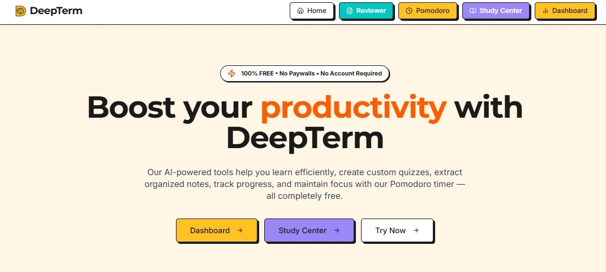

[](https://opensource.org/licenses/MIT)
[](https://www.typescriptlang.org/)
[](https://reactjs.org/)
[](https://tailwindcss.com/)
[](https://vitejs.dev/)

**DeepTerm** is a comprehensive, completely free AI-powered bring your own key productivity and learning platform designed to boost your study efficiency. It combines multiple tools in one seamless experience, featuring flashcards, quizzes, note extraction, Pomodoro timer, and gamified learning. 

🌐 **Live Demo**: [https://deepterm.tech](https://deepterm.tech)

## ✨ Key Features

### 🧠 AI-Powered Tools
- **Smart Note Extraction**: Transform complex documents into organized notes with key terms and definitions
- **Custom Quiz Generator**: Create personalized quizzes from your study materials with multiple question types
- **Intelligent Flashcards**: Generate interactive flashcards with spaced repetition algorithms
- **Content Processing**: Supports text input, file uploads (PDF, DOCX, TXT), and various document formats

### ⏰ Productivity Features
- **Pomodoro Timer**: Customizable work/break cycles with integrated task management
- **Task Management**: Built-in to-do list with progress tracking
- **Focus Sessions**: Audio alerts and visual progress indicators
- **Study Streaks**: Track daily focus sessions and maintain learning momentum

### 🎮 Gamified Learning Experience
- **Achievement System**: Unlock badges and earn experience points
- **Level Progression**: Advance through levels based on study time and activities
- **Progress Dashboard**: Visual charts and statistics tracking
- **Streak Tracking**: Daily study streaks and consistency rewards

### 📊 Analytics & Insights
- **Study Analytics**: Detailed progress tracking and performance metrics
- **Quiz Statistics**: Track scores, completion rates, and improvement over time
- **Flashcard Metrics**: Monitor accuracy rates and study session effectiveness
- **Time Tracking**: Comprehensive study time logging and analysis

## 🛠 Tech Stack

### Frontend Framework
- **React 18.3.1** - Modern React with hooks and functional components
- **TypeScript 5.5.3** - Type-safe development with full TypeScript support
- **Vite 5.4.1** - Fast build tool and development server

### UI & Styling
- **Tailwind CSS 3.4.11** - Utility-first CSS framework with custom neobrutalism design
- **Radix UI** - Accessible, unstyled UI components
- **Shadcn/ui** - Modern component library built on Radix UI
- **Framer Motion 12.7.4** - Smooth animations and transitions
- **Lucide React** - Beautiful, customizable SVG icons

### State Management & Data
- **React Context API** - Centralized state management for user profiles, flashcards, and quiz data
- **TanStack Query 5.56.2** - Server state management and caching
- **Local Storage** - Persistent client-side data storage

### AI Integration
- **Google Generative AI (Gemini)** - AI-powered content generation and processing
- **Gemini 2.5 Flash** - Fast, high-quality text generation for educational content

### Development Tools
- **ESLint 9.9.0** - Code linting with React-specific rules
- **PostCSS 8.4.47** - CSS processing and optimization
- **Autoprefixer** - Automatic vendor prefix handling

## 🚀 Quick Start

### Prerequisites
- **Node.js** >= 18.0.0
- **npm** >= 9.0.0
- **Google Gemini API Key** (for AI features)

### Installation

1. **Clone the repository**
   ```bash
   git clone https://github.com/YOUR_USERNAME/deepterm.git
   cd deepterm
   ```

2. **Install dependencies**
   ```bash
   npm install
   ```

3. **Environment Setup**
   ```bash
   # Copy the example environment file
   cp .env.example .env
   
   # Edit .env and add your Google Gemini API key
   # VITE_GEMINI_API_KEY=your_actual_api_key_here
   ```

4. **Start development server**
   ```bash
   npm run dev
   ```

5. **Open your browser**
   Navigate to `http://localhost:8080`

### API Key Configuration
1. Visit [Google AI Studio](https://makersuite.google.com/app/apikey)
2. Create a new Gemini API key
3. Option A: Add to `.env` file: `VITE_GEMINI_API_KEY=your_key_here`
4. Option B: In the DeepTerm app, click the "⚙️ Settings" button and enter your API key

## 📁 Project Structure

```
deepterm/
├── public/                 # Static assets
│   ├── audio files        # Notification sounds
│   ├── icons/             # Favicon and app icons
│   ├── og-image.jpg       # Social sharing image
│   └── sitemap.xml        # SEO sitemap
├── src/
│   ├── components/        # Reusable UI components
│   │   ├── ui/           # Shadcn/ui components
│   │   ├── flashcard/    # Flashcard-specific components
│   │   ├── quiz/         # Quiz-related components  
│   │   └── shared/       # Common components
│   ├── context/          # React Context providers
│   │   ├── FlashcardContext.tsx    # Flashcard state management
│   │   ├── PomodoroContext.tsx     # Timer state management
│   │   ├── QuizContext.tsx         # Quiz state management
│   │   └── UserProfileContext.tsx  # User data and achievements
│   ├── hooks/            # Custom React hooks
│   ├── lib/              # Utility libraries
│   ├── pages/            # Application pages/routes
│   ├── services/         # API services and integrations
│   │   ├── geminiService.ts        # AI integration
│   │   ├── quizGenerator.ts        # Quiz generation logic
│   │   └── activityService.ts      # User activity tracking
│   ├── types/            # TypeScript type definitions
│   ├── utils/            # Helper functions and utilities
│   └── main.tsx          # Application entry point
├── api/                  # Serverless API routes (currently empty)
├── components.json       # Shadcn/ui configuration
├── tailwind.config.ts    # Tailwind CSS configuration
├── vite.config.ts        # Vite build configuration
└── vercel.json          # Vercel deployment configuration
```

## 🎯 Available Scripts

- `npm run dev` - Start development server with hot reload
- `npm run build` - Build production bundle
- `npm run preview` - Preview production build locally
- `npm run lint` - Run ESLint for code quality checks

## 🤝 Contributing

We welcome contributions! Here's how to get started:

### Development Setup
1. Fork the repository
2. Create a feature branch: `git checkout -b feature/amazing-feature`
3. Make your changes and test thoroughly
4. Commit with clear messages: `git commit -m 'Add amazing feature'`
5. Push to your branch: `git push origin feature/amazing-feature`
6. Open a Pull Request

### Contribution Guidelines
- **Code Style**: Follow the existing TypeScript/React patterns
- **Testing**: Ensure your changes don't break existing functionality
- **Documentation**: Update README and code comments as needed
- **Accessibility**: Maintain WCAG 2.1 AA compliance
- **Performance**: Consider impact on bundle size and runtime performance

## 📄 License

This project is licensed under the MIT License - see the [LICENSE](LICENSE) file for details.

## 🙏 Acknowledgments

- **Google Gemini AI** - For providing powerful AI capabilities
- **Shadcn/ui** - For the beautiful, accessible component library
- **Radix UI** - For unstyled, accessible UI primitives
- **Tailwind CSS** - For the utility-first CSS framework
- **React Community** - For the amazing ecosystem and best practices

## 📞 Support & Contact

- **Website**: [https://deepterm.tech](https://deepterm.tech)
- **Issues**: [GitHub Issues](https://github.com/4regab/deepterm/issues)
- **Email**: Contact through GitHub

---

**DeepTerm** - Empowering learners with Free AI-powered productivity tools. Built with ❤️ for the open source community.

## Star History

[](https://www.star-history.com/#4regab/deepterm&Date)

⭐ **Star this repository** if you find DeepTerm helpful!
